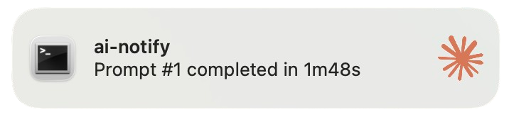

# ai-notify

Desktop notification system for Claude Code and Codex CLI that tracks session activity and sends macOS notifications for
key events.



## Installation

> [!NOTE]
>
> This CLI works only on macOS at the moment.

### Prerequisites

- Python 3.12+
- [uv](https://github.com/astral-sh/uv) package manager
- [terminal-notifier](https://github.com/julienXX/terminal-notifier) app: Install with `brew install terminal-notifier`

### Installation

At the moment, the CLI can only be installed from source. You have to clone the repository and run the install command:

```bash
git clone https://github.com/PaulRBerg/ai-notify.git
cd ai-notify
uv tool install --force .
```

To update, `git pull` and re-run the install command.

## Features

- **Smart Notifications**: Only notifies for jobs exceeding a configurable duration threshold (default: 10s)
- **Prompt Filtering**: Exclude specific prompt patterns (e.g., slash commands like `/commit`) from notifications
- **Session Tracking**: SQLite database tracks prompts, durations, and job numbers
- **Auto-cleanup**: Automatic data cleanup with optional export before deletion
- **Event Handlers**: CLI subcommands for Claude Code hooks and Codex CLI notify integration
- **Configuration**: YAML-based configuration with sensible defaults
- **Rich Notifications**: Custom Claude icon, configurable sounds, and click-to-focus terminal support

### Comparison with CCNotify

Inspired by [CCNotify](https://github.com/dazuiba/CCNotify) with key improvements:

- **Independent CLI** — installable via `uv tool install`, not a script symlink
- **Fully configurable** — YAML config with `ai-notify config` commands
- **More events** — supports `PermissionRequest` (4 events vs 3)
- **Smart filtering** — configurable duration threshold and prompt exclusion patterns
- **Notification modes** — all/permission_only/disabled

## Configuration

ai-notify uses YAML configuration stored at `~/.config/ai-notify/config.yaml`.

### View current configuration

```bash
ai-notify config show
```

### Edit configuration

```bash
ai-notify config edit
```

### Reset to defaults

```bash
ai-notify config reset
```

### Configuration options

```yaml
cleanup:
  auto_cleanup_enabled: true # Enable automatic cleanup of old data
  export_before_cleanup: true # Export data before cleanup
  retention_days: 30 # Number of days to retain session data (older data will be auto-cleaned)

database:
  path: ~/.config/ai-notify/ai-notify.db # Path to SQLite database file

logging:
  level: INFO # Log level (DEBUG, INFO, WARNING, ERROR, CRITICAL)
  path: ~/.config/ai-notify/ai-notify.log # Path to log file

notification:
  app_bundle: dev.warp.Warp-Stable # Application bundle ID to focus on notification click
  mode: all # Notification mode: 'all' (default), 'permission_only', or 'disabled'
  sound: default # Notification sound (see /System/Library/Sounds for options)
  threshold_seconds: 10 # Minimum job duration in seconds to trigger notification (0 = notify all)
  exclude_patterns: # List of prompt prefixes to exclude from notifications (case-sensitive)
    - /commit
    - /update-pr
    - /fix-issue
```

**Database durability note**

ai-notify uses SQLite WAL mode with `synchronous=NORMAL` for speed. In the event of a sudden power loss or crash, the
latest session writes can be lost. This is acceptable for transient session tracking data, but be aware if you require
strict durability.

**Prompt Pattern Filtering**

The `exclude_patterns` configuration allows you to filter out notifications for specific prompts:

- **Prefix matching**: Patterns match prompts that _start with_ the pattern (case-sensitive)
- **Common use case**: Exclude slash commands like `/commit`, `/update-pr`, etc.
- **Examples**:
  - Pattern `/commit` matches: `/commit`, `/commit --all`, `/commit -m "message"`
  - Pattern `/commit` does NOT match: `Commit changes`, `run /commit`, `/Commit` (different case)
- **Default**: Empty list (no filtering)

## Usage

### Test notifications

```bash
ai-notify test
```

### Clean up old data

```bash
# Preview cleanup (dry run)
ai-notify cleanup --dry-run

# Clean up with confirmation
ai-notify cleanup

# Clean up with custom retention
ai-notify cleanup --days 60

# Clean up without export
ai-notify cleanup --no-export
```

### Event handlers (Claude Code integration)

The following commands are designed to be called from Claude Code hooks:

```bash
# Track user prompt submission
ai-notify event user-prompt-submit < event_data.json

# Handle stop event (sends notifications)
ai-notify event stop < event_data.json

# Handle notification event
ai-notify event notification < event_data.json

# Handle permission request
ai-notify event permission-request < event_data.json
```

For Codex CLI, use `ai-notify codex` via the `notify` setting (see below).

## Claude Code Hook Integration

To integrate ai-notify with Claude Code, update your `~/.claude/hooks/hooks.json`. You can also install the hooks
automatically:

```bash
ai-notify link claude
```

For more information about Claude Code hooks, see the
[official documentation](https://docs.claude.com/en/docs/claude-code/hooks).

```json
{
  "hooks": {
    "UserPromptSubmit": {
      "command": "ai-notify event user-prompt-submit"
    },
    "Stop": {
      "command": "ai-notify event stop"
    },
    "Notification": {
      "command": "ai-notify event notification"
    },
    "PermissionRequest": {
      "command": "ai-notify event permission-request"
    }
  }
}
```

## Codex CLI Integration

Codex CLI can invoke ai-notify through the `notify` setting in your root config file (`~/.codex/config.toml`).

```toml
notify = ["ai-notify", "codex"]
```

You can also set this automatically:

```bash
ai-notify link codex
```

Codex appends the JSON payload as the final CLI argument, so the effective command looks like:

```bash
ai-notify codex '<json payload>'
```

The Codex notify payload does not include job duration, so `notification.threshold_seconds` is not applied for Codex
notifications. Exclude patterns and notification mode still apply.

## Integration Check

Use the built-in checker to see whether Claude Code hooks and Codex notify are configured:

```bash
ai-notify check
```

## How It Works

1. **UserPromptSubmit**: When you submit a prompt to Claude Code, ai-notify tracks it in the database
2. **Stop**: When Claude finishes (or you stop it), ai-notify:
   - Calculates the duration
   - Checks if duration >= threshold
   - Checks if prompt starts with any excluded pattern
   - Sends notification only if both checks pass (by default, whether the job took longer than >10 seconds)
   - Optionally runs auto-cleanup (every 24 hours)
3. **Notification**: Suppresses "waiting for input" notifications (the Stop handler will send job completion)
4. **PermissionRequest**: Sends immediate notification when Claude requests permissions

For Codex CLI, ai-notify runs on the `agent-turn-complete` notify event and sends a completion notification with the
latest assistant message as context.

## File Structure

```
~/.config/ai-notify/
├── config.yaml             # User configuration
├── ai-notify.db            # SQLite session database
├── ai-notify.log           # Application logs
└── exports/                # JSON exports before cleanup
```

## Documentation

- [Claude Code](https://code.claude.com/docs/en/overview)
- [Hooks](https://docs.claude.com/en/docs/claude-code/hooks)
- [Codex CLI configuration](https://developers.openai.com/codex/local-config)

## License

MIT License - see [LICENSE.md](LICENSE.md)
