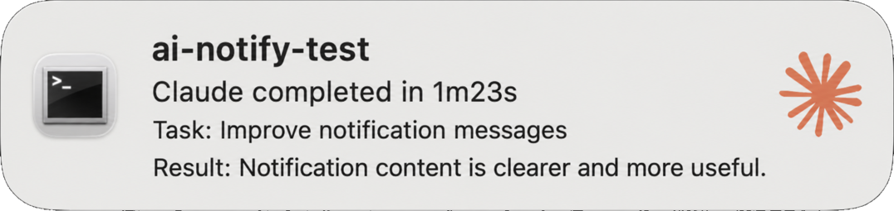

# ai-notify

Desktop notification system for Claude Code and Codex CLI that tracks session activity and sends macOS notifications for
key events.



## Installation

> [!NOTE]
>
> This CLI works only on macOS at the moment.

### Prerequisites

- Python 3.12+
- [uv](https://github.com/astral-sh/uv) package manager
- [terminal-notifier](https://github.com/julienXX/terminal-notifier) app: Install with `brew install terminal-notifier`

### Installation

At the moment, the CLI can only be installed from source. You have to clone the repository and run the install command:

```bash
git clone https://github.com/PaulRBerg/ai-notify.git
cd ai-notify
uv tool install --force .
```

To update, `git pull` and re-run the install command.

## Features

- **Smart Notifications**: Only notifies for jobs exceeding a configurable duration threshold (default: 10s)
- **Prompt Filtering**: Exclude specific prompt patterns (e.g., slash commands like `/commit`) from notifications
- **Session Tracking**: SQLite database tracks prompts, durations, and job numbers
- **Auto-cleanup**: Automatic data cleanup with optional export before deletion
- **Event Handlers**: CLI subcommands for Claude Code hooks and Codex CLI notify integration
- **Configuration**: YAML-based configuration with sensible defaults
- **Rich Notifications**: Custom Claude icon, configurable sounds, and click-to-focus terminal support

### Comparison with CCNotify

Inspired by [CCNotify](https://github.com/dazuiba/CCNotify) with key improvements:

- **Independent CLI** — installable via `uv tool install`, not a script symlink
- **Fully configurable** — YAML config with `ai-notify config` commands
- **More events** — adds `PermissionRequest`, `StopFailure`, and an AskUserQuestion notifier (6 hooks vs 3)
- **Smart filtering** — configurable duration threshold and prompt exclusion patterns
- **Notification modes** — all/permission_only/disabled

## Configuration

ai-notify uses YAML configuration stored at `~/.config/ai-notify/config.yaml`.

### View current configuration

```bash
ai-notify config show
```

### Edit configuration

```bash
ai-notify config edit
```

### Reset to defaults

```bash
ai-notify config reset
```

### Configuration options

```yaml
cleanup:
  auto_cleanup_enabled: true # Enable automatic cleanup of old data
  export_before_cleanup: true # Export data before cleanup
  retention_days: 30 # Number of days to retain session data (older data will be auto-cleaned)

database:
  path: ~/.config/ai-notify/ai-notify.db # Path to SQLite database file

logging:
  level: INFO # Log level (DEBUG, INFO, WARNING, ERROR, CRITICAL)
  path: ~/.config/ai-notify/ai-notify.log # Path to log file

notification:
  app_bundle: com.googlecode.iterm2 # Application bundle ID to focus on notification click
  mode: all # Notification mode: 'all' (default), 'permission_only', or 'disabled'
  sound: default # Notification sound (see /System/Library/Sounds for options)
  threshold_seconds: 10 # Minimum job duration in seconds to trigger notification (0 = notify all)
  exclude_patterns: # List of prompt prefixes to exclude from notifications (case-sensitive)
    - /commit
    - /update-pr
    - /fix-issue
```

**Database durability note**

ai-notify uses SQLite WAL mode with `synchronous=NORMAL` for speed. In the event of a sudden power loss or crash, the
latest session writes can be lost. This is acceptable for transient session tracking data, but be aware if you require
strict durability.

**Prompt Pattern Filtering**

The `exclude_patterns` configuration allows you to filter out notifications for specific prompts:

- **Prefix matching**: Patterns match prompts that _start with_ the pattern (case-sensitive)
- **Common use case**: Exclude slash commands like `/commit`, `/update-pr`, etc.
- **Examples**:
  - Pattern `/commit` matches: `/commit`, `/commit --all`, `/commit -m "message"`
  - Pattern `/commit` does NOT match: `Commit changes`, `run /commit`, `/Commit` (different case)
- **Default**: Empty list (no filtering)

## Usage

### Test notifications

```bash
ai-notify test
```

### Clean up old data

```bash
# Preview cleanup (dry run)
ai-notify cleanup --dry-run

# Clean up with confirmation
ai-notify cleanup

# Clean up with custom retention
ai-notify cleanup --days 60

# Clean up without export
ai-notify cleanup --no-export
```

### Event handlers (Claude Code integration)

The following commands are designed to be called from Claude Code hooks:

```bash
# Track user prompt submission
ai-notify event user-prompt-submit < event_data.json

# Handle stop event (sends notifications)
ai-notify event stop < event_data.json

# Handle API failure event (sends failure notifications)
ai-notify event stop-failure < event_data.json

# Handle notification event
ai-notify event notification < event_data.json

# Handle permission request
ai-notify event permission-request < event_data.json

# Notify when Claude asks a question (PreToolUse / AskUserQuestion)
ai-notify event ask-user-question < event_data.json
```

For Codex CLI, use `ai-notify codex` via the `notify` setting (see below).

## Claude Code Hook Integration

Claude Code reads hooks from its settings files — `~/.claude/settings.json` (all projects) or a project's
`.claude/settings.json` / `.claude/settings.local.json`. Install the ai-notify hooks automatically:

```bash
ai-notify link claude
```

This merges the hooks into `~/.claude/settings.json` without touching your other settings. Use `--path` to target a
project or local settings file, `--dry-run` to preview, and `--force` to replace a conflicting entry. For more
information about Claude Code hooks, see the [official documentation](https://code.claude.com/docs/en/hooks).

The resulting `hooks` section uses Claude Code's nested schema (each event maps to a list of matcher groups):

```json
{
  "hooks": {
    "UserPromptSubmit": [{ "hooks": [{ "type": "command", "command": "ai-notify event user-prompt-submit" }] }],
    "Stop": [{ "hooks": [{ "type": "command", "command": "ai-notify event stop" }] }],
    "StopFailure": [{ "hooks": [{ "type": "command", "command": "ai-notify event stop-failure" }] }],
    "Notification": [{ "hooks": [{ "type": "command", "command": "ai-notify event notification" }] }],
    "PermissionRequest": [{ "hooks": [{ "type": "command", "command": "ai-notify event permission-request" }] }],
    "PreToolUse": [
      {
        "matcher": "AskUserQuestion",
        "hooks": [{ "type": "command", "command": "ai-notify event ask-user-question" }]
      }
    ]
  }
}
```

> **Upgrading:** Claude Code does not read standalone `~/.claude/hooks/hooks.json` or global
> `~/.claude/settings.local.json` files. Re-run `ai-notify link claude` to install into `~/.claude/settings.json`, then
> remove stale hook configuration from those ignored locations. `ai-notify check` reports them when present.

Claude Code fires `StopFailure` instead of `Stop` when an API error ends a turn. ai-notify marks the tracked prompt
failed and, in `all` mode, alerts immediately without applying the duration threshold or prompt exclusions. Normal
`Stop` events do not complete the tracked prompt while the payload lists background tasks or session crons. A user
interrupt fires neither `Stop` nor `StopFailure`, so it cannot produce a completion notification.

## Codex CLI Integration

Codex CLI can invoke ai-notify through the `notify` setting in your root config file (`~/.codex/config.toml`).

```toml
notify = ["ai-notify", "codex"]
```

You can also set this automatically:

```bash
ai-notify link codex
```

An existing different root `notify` command is left unchanged and causes a nonzero exit. Review the reported previous
value, then replace it explicitly if intended:

```bash
ai-notify link codex --force
```

Codex profiles are separate files next to the base config, not `[profiles.<name>]` tables. To configure
`~/.codex/review.config.toml`:

```bash
ai-notify link codex --profile review
```

Profile names may contain letters, numbers, hyphens, and underscores. The profile file overlays the base
`~/.codex/config.toml`, so it only needs a `notify` value when it should override the base. See the official
[profile](https://developers.openai.com/codex/config-advanced#profiles) and
[notification](https://developers.openai.com/codex/config-advanced#notifications) documentation.

Codex appends the JSON payload as the final CLI argument, so the effective command looks like:

```bash
ai-notify codex '<json payload>'
```

The Codex notify payload does not include job duration, so `notification.threshold_seconds` is not applied for Codex
notifications. Exclude patterns and notification mode still apply.

## Integration Check

Use the built-in checker to see whether Claude Code hooks and Codex notify are configured:

```bash
ai-notify check

# Check the effective base + profile configuration
ai-notify check --profile review
```

## How It Works

1. **UserPromptSubmit**: When you submit a prompt to Claude Code, ai-notify tracks it in the database
2. **Stop**: When Claude finishes with no pending background tasks or session crons, ai-notify:
   - Calculates the duration
   - Checks if duration >= threshold
   - Checks if prompt starts with any excluded pattern
   - Sends notification only if both checks pass (by default, whether the job took longer than >10 seconds)
   - Optionally runs auto-cleanup (every 24 hours)
3. **StopFailure**: When an API error ends the turn, marks the prompt stopped and sends the documented error text in
   `all` mode, even for short or excluded prompts. If the prompt was not tracked, sends a generic failure notification.
4. **Notification**: Detects "waiting for input" notifications (via the `idle_prompt` notification type, with a keyword
   fallback) and suppresses them — the Stop handler sends the job-completion notification
5. **PermissionRequest**: Sends an immediate notification when Claude requests permission to run a tool
6. **PreToolUse / AskUserQuestion**: Sends a notification when Claude asks you a question

For Codex CLI, ai-notify runs on the `agent-turn-complete` notify event and sends a completion notification with the
latest assistant message as context.

## File Structure

```
~/.config/ai-notify/
├── config.yaml             # User configuration
├── ai-notify.db            # SQLite session database
├── ai-notify.log           # Application logs
└── exports/                # JSON exports before cleanup
```

## Documentation

- [Claude Code](https://code.claude.com/docs/en/overview)
- [Claude Code hooks](https://code.claude.com/docs/en/hooks)
- [Codex CLI advanced configuration](https://developers.openai.com/codex/config-advanced)

## License

MIT License - see [LICENSE.md](LICENSE.md)
